# 🥣 Local Granola

### **Your Personal, Private AI Chief of Staff.**


---

**Voice memos are the highest-bandwidth way to capture ideas, but the lowest-bandwidth way to retrieve them.**

Local Granola solves this. It watches your voice memos folder, uses Google Gemini to transcribe and analyze them _with context from your recent notes_, and files a structured executive summary directly into your Obsidian Daily Note.

## ⚡ The Workflow

It runs entirely in the background. You talk, it writes.

```mermaid
flowchart LR
    A[🎙️ iPhone Memo] -->|iCloud| B[👀 Mac Watcher]
    B -->|Audio + Context| C[🧠 Gemini Flash]
    C -->|Structured Note| D[📓 Obsidian]
    B -->|Archive| E[📂 Local Archive]
    C -.->|Delete| F[🗑️ Google Cloud]

    style A fill:#f9f,stroke:#333,stroke-width:2px
    style D fill:#bbf,stroke:#333,stroke-width:2px
    style F fill:#faa,stroke:#333,stroke-width:2px
```



## ✨ Features

- **🧠 Context-Aware:** It reads your last 3 Obsidian daily notes before processing. It knows _who_ you are meeting and _what_ you are working on, so it spells "Project Phoenix" correctly instead of "Project Feeny".
- **🔒 The Flash Protocol:** Your data touches the cloud for less than 60 seconds.
  1.  Upload to Gemini.
  2.  Process & Summarize.
  3.  **Immediately Delete** from cloud.
- **📁 Zero Friction:** No buttons to press on your Mac. Just record on your phone, and it appears on your desktop.
- **💰 Practically Free:** Uses Gemini 1.5 Flash (extremely cheap/free tier).

## 🛠️ Setup Guide

### 1. Prerequisites

- Python 3.10+
- [FFmpeg](https://ffmpeg.org/download.html) (Essential for audio processing)
  - Mac: `brew install ffmpeg`
- A Google Cloud API Key for Gemini.

### 2. Installation

```bash
# Clone the repo
git clone https://github.com/correctbuddy789/local-granola.git
cd local-granola

# Install dependencies
pip install -r requirements.txt
```

### 3. Configuration

Create a `.env` file from the example:

```bash
cp .env.example .env
```

Edit `.env` with your paths:

```ini
GEMINI_API_KEY="your_key_here"
WATCH_DIR="/Users/you/Library/Mobile Documents/com~apple~CloudDocs/Voice Memos"
OBSIDIAN_VAULT="/Users/you/Documents/ObsidianVault"
OBSIDIAN_DAILY_NOTE_PATH="Daily Notes/"
```

### 4. Run It

```bash
python main.py
```

_Tip: Use `launchd` or `supervisor` to keep this running in the background forever._

---

## 🔒 Privacy Architecture

We believe your thoughts belong to you.

| Step              | Location      | Data Status                                                                     |
| :---------------- | :------------ | :------------------------------------------------------------------------------ |
| **1. Recording**  | iPhone/iCloud | Encrypted by Apple                                                              |
| **2. Processing** | Google Gemini | **Transient.** Uploaded, processed, and explicitly deleted via API immediately. |
| **3. Storage**    | Local Disk    | **Permanent.** Markdown summary and MP3 archive stored locally.                 |

---

_Built with boredom by [Tushar Nain](https://nain.run)._
